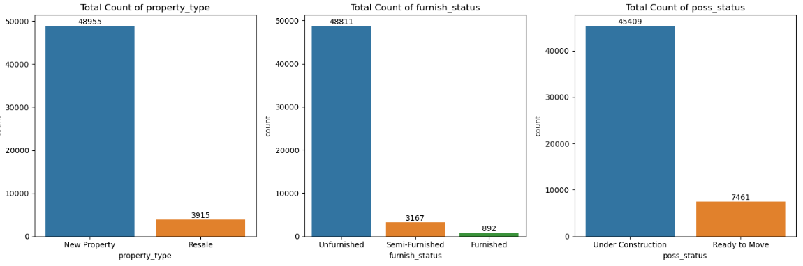
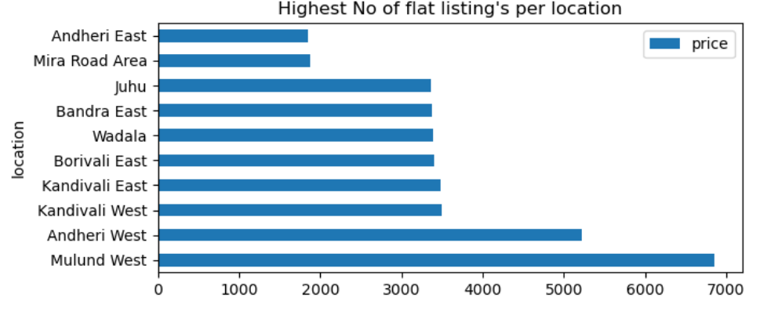
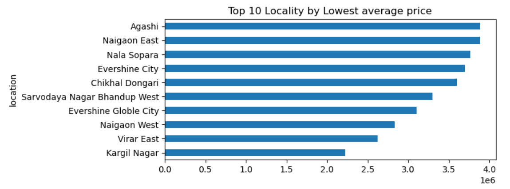
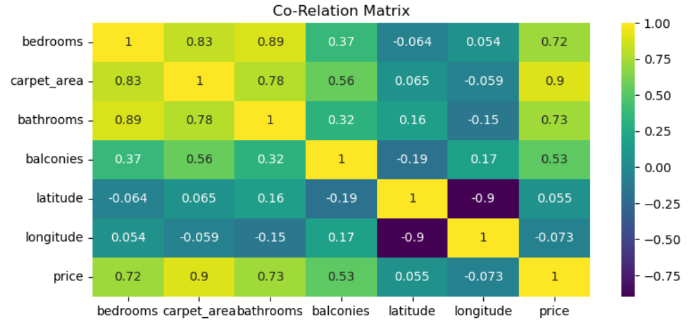
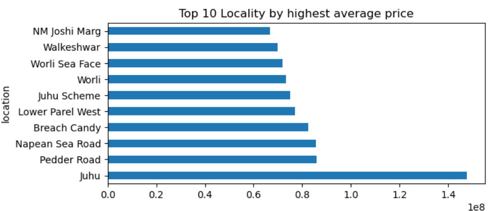
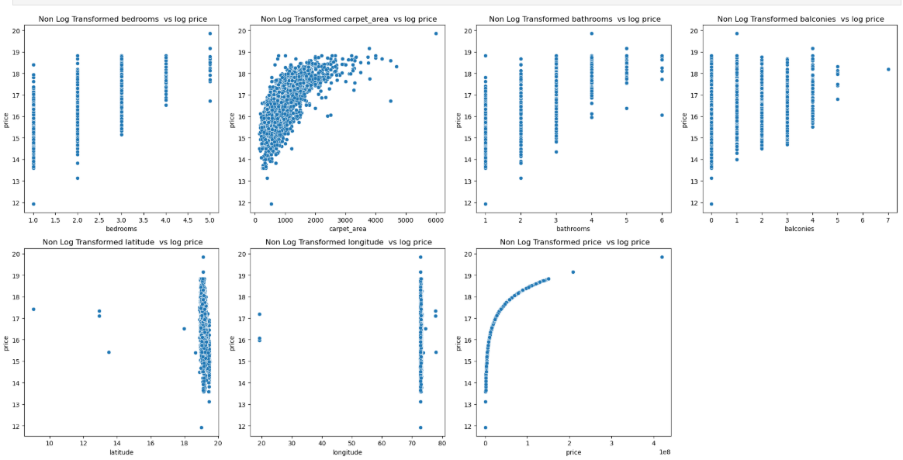

Banner [source](https://banner.godori.dev/)

-- 
# 🏠 Mumbai Property Price Estimator
#### AppLink - https://mumbaipriceteller.onrender.com

## 🔍 Business Problem
Property Buying in Mumbai can be confusing with significant price variation across various locations, property types, carpet area, furnish status etc. This app uses machine learning alogortihms and complex data analytical techniques to help homebuyers, sellers, and investors make informed pricing decisions by estimating Real-time property prices across Mumbai.

## 🧠 **Key Findings:**  
> Majority of the Flat listings are new properties which are Unfurnished.
> The Western and southern belt of mumbai has high property prices as compared to others.
> The Northern Belt of mumbai has affordable and less property prices.
> The Maximum No property were listed from bhandup, andheri, Mulund.
> Feature engineering, especially `price_per_sqft` and target encoding for `location`, significantly boosted model accuracy and reduced margin of error.  
> After tuning, XGBoost achieved **99% R² score** and **1% error margin**, making it ideal for real-time price prediction.

---
## 📊 Data Source
- Data scraped from [MagicBricks](https://www.magicbricks.com/) using Scrapy via MagicBricks Backend Api.
- Stored in SQLite3 database for easy access and analysis.

---

## ⚙️ Methods

- **Data Scraping & Storage:** Scrapy used to pull data from MagicBricks’ backend API. Structured it into a SQLite database. Established connection with the database using sqlite3 library.
- **Data Cleaning and Transformations:**  Imputed Null Values , dropped some null values from different columns also fixed column datatypes and converted transfromed column values.
- **Outlier Handling:** Plotted Box plots for Visualizing Outliers, Handled outliers in different numeric column based on domain knowledge.
- **Univariate & Bivariate Analysis:** Used histograms, scatterplots, and countplots to explore distributions and variable relationships.
- **Correlation Analysis:**  
  - Pearson correlation heatmap for numerical features.  
  - ANOVA F-test for evaluating categorical feature importance.
- **Feature Engineering & Encoding:**
  - Dropped Columns which did not affect the target price.  
  - Added `price_per_sqft` as a derived metric.  
  - Target Encoding applied to `location` for better model input.
- **Model Training & Evaluation:**  
  - Trained and evaluated Linear Regression, Ridge, Random Forest, and XGBoost.  
  - Developed a metric evaluation function for automated comparison.
- **Model Tuning & Performance Boost:**  
  - Fine-tuned XGBoost model with hyperparameters.
  - Saved the Tuned Model for predictions, Calculated residuals and residuals_pct and visualized the margin of error. Using feature engineering handled margin of erorr.  
  - Reduced Margin of Error from **7.14% ➝ 1%**, improved R² from **0.92 ➝ 0.99**.

---

## 🧱 Tech Stack

- **Python** (3.10+)
- **Scrapy** (for API Scraping)
- **SQLite3** (for Data Storage)
- **Pandas, NumPy, Matplotlib, Seaborn** (EDA & Visualization)
- **Scikit-learn & XGBoost** (model training & tuning)
- **Flask** (API and backend interface)
- **Render** (for app deployment)

---

## 🔥 Key Results & Visuals

### 1. CountPlot of Categorical variables   

### 2. Barchart of No of Flat listings per location (Top10)  

### 3. BarChart of Localities with Lowest avg_price of Properties.   

### 4. Co-Relation Matrix: Visualizing the Co-relation of different features affecting the target.

### 5. BarChart of Localities with Highest avg_price of Properties.  

### 6. ScatterPlot: Relationships of Different features with the Target(Price).

### 📈 Visualizng Model Performance, Error Margin, Metrics:

### Model Metrics Without Feature Enginerring:
**We are checking for Error margin >10% , meaning for how many records the model predicted price more or less than 10%**

| Model              | R² Score | Error Margin > 10| 
|--------------------|----------|---------------   |
| XGBoost            | 0.97     | 7.76%            |
| Random Forest      | 0.98     | 7.14%            |
| Linear Regression  | 0.89     | 9.12%            |

### Model Metrics After Feature Enginerring: (Generated price_per_sqrft for better model interpretability) 

| Model              | R² Score | Error Margin > 10|
|--------------------|----------|----------------  |
| XGBoost (tuned)    | 0.93     | 1%               |
| Random Forest      | 0.99     | 2%               |
| Linear Regression  | 1.00     | 4%               | 

✅ Final Model Used: **XGBoost (with hyperparameter tuning)**  
🎯 Metric Used: **R² Score & Error Margin**
---

## 🚀 Deployment
- The model is deployed using Flask and hosted on **Render**.
- REST API created for real-time price predictions.
- Scalable architecture to allow future city integrations.

---

## 💡 Future Improvements

- Integrate live listings to keep model updated.
- Expand prediction to other metro cities.
- Add filters for user preferences like floor number, facing, etc.
- Move toward a full frontend interface with map-based insights.

---

## 🧾 License
This project is licensed under the MIT License. Feel free to use, fork, and improve upon it.
---

### 👤 Author
Developed and Documented by Adin Raja **Adin Raja** – [LinkedIn](https://www.linkedin.com/in/adinraja78/), [Gmail](adinraja78@gmail.com)

---
