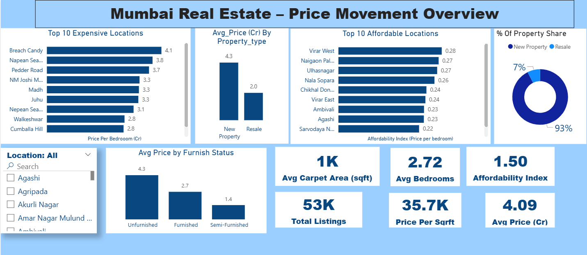

  

# 🏠 Mumbai Property Price Estimator
#### Live Site - [MumbaiPriceTeller](https://mumbaipriceteller.onrender.com)

## 🔍 Problem Statement
Buying a property in Mumbai is often confusing because prices vary widely depending on the location, property type, size (carpet area), and furnishing status. This lack of clarity makes it difficult for homebuyers to know if they are paying a fair price, for sellers to set the right price, and for investors to identify good opportunities.

## Project Overview
This project presents a full-stack machine learning solution for real-time property price estimation in Mumbai. It combines dynamic data scraping from MagicBricks API, with ETL workflows and advanced predictive models to deliver accurate price estimations. Built with Flask and deployed on Render, this app makes it easy for users to check property valuations.

## Demo video
https://github.com/user-attachments/assets/b0082dd6-0465-4369-b7b3-9b243dc4f933

## Power BI Dashboard:

**Power Bi Dashboard for Analyzing How Property Prices Fluctuate across entire mumbai.**

## 🧠 Key Findings: 
1. Majority of the Flat listings are new properties which are Unfurnished.
2. The Western and southern belt of mumbai has high property prices as compared to others.
3. The Northern Belt of mumbai has affordable and less property prices.
4. The Maximum No property were listed from bhandup, andheri, Mulund.
5. Feature engineering, especially `area per bedroom` and target encoding for `location`, significantly boosted model accuracy and reduced margin of error.  
6. After feature engineering and fine-tuning, XGBoost achieved **99% R² score** and **6% error margin**, making it ideal for real-time price prediction.

## Technical Details

- `Data Scraping & Storage:` Scrapy used to pull data from MagicBricks’ backend API. Structured it into a SQLite database. Established connection with the database using python and sqlite3 library.

- `Outlier Handling:` Plotted Box plots for Visualizing Outliers, Handled outliers in different numeric column based on domain knowledge.

- `Univariate & Bivariate Analysis:` Used histograms, scatterplots, and countplots to explore distributions and variable relationships.

- `Feature Engineering & Encoding:` Dropped Columns which did not affect the target price. Added `area per bedroom` as a derived metric only for training the model, In Inference phase calculated `area per bedroom` internally in the flask backend. Target Encoding applied to `location` for better model input.

- `Model Training & Evaluation:`  
  - Trained and evaluated Linear Regression, Ridge, Random Forest, and XGBoost.  
  - Calculated metrics like train score, test score, r2 Score and **ERROR MARGIN**

- `Model Fine-Tuning & Performance Boost:`
  - Fine-tuned XGBoost model with hyperparameters.
  - Saved the Tuned Model for predictions, Calculated residuals and residuals_pct and visualized the margin of error. Using feature engineering Reduced Margin of Error from **7.8% ➝ 6%**, improved R² from **0.97 ➝ 0.99**.

## 📈 Visualizng Model Performance, Error Margin, Metrics:

### Model Metrics Without Feature Enginerring:
**We are checking for Error margin >10% , meaning for how many records the model predicted price more or less than 10%**

| Model              | R² Score | Error Margin > 10| 
|--------------------|----------|---------------   |
| XGBoost            | 0.97     | 7.76%            |
| Random Forest      | 0.98     | 7.14%            |
| Linear Regression  | 0.89     | 9.12%            |

### Model Metrics After Feature Enginerring: (Generated area per bedroom for better model interpretability) 

| Model              | R² Score | Error Margin > 10|
|--------------------|----------|----------------  |
| XGBoost (tuned)    | 0.99     | 6.2%               |
| Random Forest      | 0.99     | 6.8%               |
| Linear Regression  | 0.93     | 8%               | 

✅ Final Model Used: **XGBoost (with hyperparameter tuning)**  
🎯 Metric Used: **R² Score & Error Margin**

## 📂 Project Structure
1. `app.py` - Flask backend code for serving the model
2. `training.ipnb` - Model training script without feature engineering
3. `training_with_FE` - Model training script with feature engineering 
4. `spider.py` - Scrapy code for scraping the magic bricks Api
5. `model.pkl` - Trained model as .pkl file

## 🧱 Tech Stack

- **Python** (3.10+)
- **Scrapy** (for API Scraping)
- **SQLite3** (for Data Storage)
- **Pandas, NumPy, Matplotlib, Seaborn** (EDA & Visualization)
- **Scikit-learn & XGBoost** (model training & tuning)
- **Flask** (API and backend interface)
- **Render** (for app deployment)

## 🔥 Key Results & Visuals

### 1. CountPlot of Categorical variables   

### 2. BarChart of Localities with Lowest avg_price of Properties.   

### 3. Co-Relation Matrix: Visualizing the Co-relation of different features affecting the target.

### 4. BarChart of Localities with Highest avg_price of Properties.  

## 💡 Future Improvements

- Integrate live listings to keep model updated.
- Run the reproducable script to get the trained model as .pkl
- Tinker around the api and expand prediction to other metro cities.

